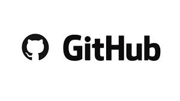
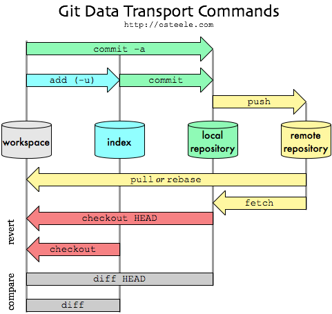

# Protokoll 1 #
Name: Skof Jonas  
Klasse: 4AHME  
KNR: 11  
Gruppe: 2  

## Inhalte ##

**1. Versionsverwaltung**  
**2. GitHub**   
**3. Markdown**     
**4. Git spezifische Befehle**  


# 1.Versionsverwaltung #

Eine Versionverwaltung verwaltet verschiedene Abläufe zu bestimmten Zeitpunkten während eines Projektes.
Weiters wird ein Versionsverwaltungs-system genutzt um zu einem späteren Zeitpunkt auf alte Versionen des selben Produktes zurückgreifen zu können.

Ziele der Versionverwaltung sind:

-->  **Teamfähigkeit**  
-->  **Schutz for sich selbst**  
-->  **Kein Datenverlust**  

Produkte: Git, CVS, SVN, Mecury, Clearcase;

Git ist heutzutage das **meist** verwendetste System.

**Geschichte:** Linus Thorwald war mit seinem damaligem System nicht zufrieden, da es keine offline Arbeit, welch er bei verschiedensten Geschäftsreisen im Flugzeug allerdings benötigte, zuließ. Also entwickelte er Git so weiter, dass eine zusätzliche lokale Repository erstellt wurde, mit welcher er offline arbeiten konnte. Bei wieder verbindung mit dem Internet konnte er dann seine Änderungen auf die Remote Repository wieder hochladen.  

# 2.Github #

  
  
GitHub ist einer der größten remote repository anbieter weltweit.Allerdings werden nur Öffentliche Repositorys kostenlos zur verfügung gestellt. Dennoch ist die freie Version von Github mehr als ausreichnend um sich mit anderen Menschen auszutauschen. 
Die .gitignore gibt an welche Dateien oder Verzeichnise nicht verwaltet werden sollen.

Eine gute Übersicht über die bedeutesten Git-Befehlen gibt folgende Grafik, in welcher auch der Datenstrom zu erkennen ist:

  

# 3. Markdown #

Markdown ist eine vereinfachte Auszeichnungssprache, welche es sich zum Ziel gesetzt hat, dass schon die Ausgangsform ohne weitere Konvertierung leicht lesbar ist.

Interessant ist vorallem Syntax-Highlighting für Quelltexte. Als Beispiel:

```javascript
function fancyAlert(arg) {
  if(arg) {
    $.facebox({div:'#foo'})
  }
}
```

Zur leichteren Bedienung kann man das Sogenannte Cheatsheet verwenden in welchem alle abkürzungen aufgelistet sind.
Es ist hilfreich sich das Cheatsheet anzusehen, in welchem verschiedenste Formattierungsoptionen erklärt werden.#

Hier sieht man die verschiedenen Markdown Befehle um z.b eine Text *Kursiv* zu machen:

✗    # Überschrift #  
✗   ## Unterüberschrift ##  
✗     * Kursiv *  
✗    ** FETT **  
✗   ```  syntax highlighting   ```  
✗    >  Zitat  
✗  Link einfügen: [name] (link)  
✗  Bild einfügen: ![name] (Dateiname)

# 4. Git spezifische Befehle #

> git clone <domain der Repository> --> Clont die Remote-Repository vom Server auf den Privatrechner. 
> git pull  --> aktualisiert die lokale repository mit der remote repository . 
> git add  <Hinzuzufügende Datei> --> Fügt die Änderungen din den Index ein.  
> git commit  -m "Commit Nachricht" --> Verschiebt die Veränderungen mit der zusäzlich angegebenen Nachricht in die Lokale -Repository.   
> git push  --> Lädt alle commits aus der Lokalen Repository in die Remote-Repository.  
  


